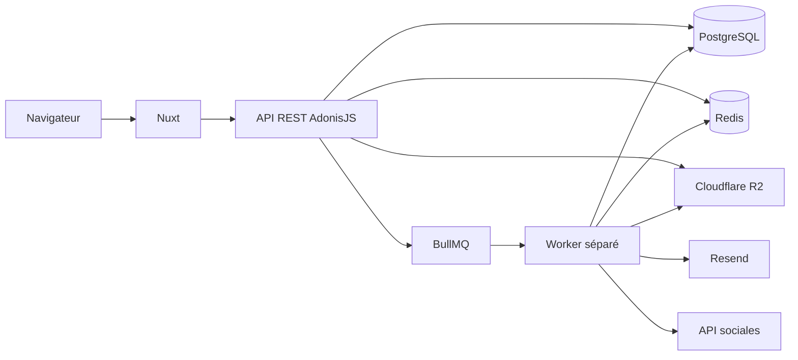

# Wepost.pro

[](https://github.com/zkyoz/wepost-pro/actions/workflows/ci.yml)

Plateforme collaborative de préparation, validation, programmation et suivi de
publications sociales pour une agence de communication et ses clients.

Wepost.pro centralise les projets, publications, médias, commentaires,
validations, calendriers éditoriaux et tentatives de publication dans un
workflow unique, traçable et accessible.

> **État du projet : candidat de préversion.** Les fonctionnalités des tâches
> 01 à 23 sont présentes dans le dépôt et la campagne locale est verte. Les
> intégrations externes utilisent encore leurs adaptateurs de test par défaut.
> La préproduction, la recette humaine, les tests RGAA manuels et les
> validations avec les véritables fournisseurs restent nécessaires avant une
> version de production.

## Fonctionnalités principales

- authentification web par session Redis, sans JWT personnalisé ;
- rôles administrateur, agence et client avec autorisations côté serveur ;
- gestion des projets, membres, publications et versions ;
- calendrier éditorial avec vues mois, semaine et liste ;
- médias privés locaux ou Cloudflare R2 avec URLs signées ;
- commentaires, décisions client, notifications et e-mails asynchrones ;
- adaptateurs Facebook, Instagram, LinkedIn, Pinterest et TikTok ;
- files BullMQ, retries, idempotence et suivi des tentatives ;
- statistiques, export CSV et abonnement iCalendar ;
- génération de textes et traductions avec validation humaine ;
- annotations accessibles des médias ;
- supervision technique, audit et sauvegardes PostgreSQL chiffrées ;
- interface française et anglaise ;
- landing page SSR, consentement PostHog et pages légales.

## Architecture



Le monorepo sépare trois processus déployables :

- `apps/web` : interface Nuxt SSR ;
- `apps/api` : API REST AdonisJS, authentification, autorisations et
  persistance ;
- `apps/worker` : e-mails, publications sociales, IA et traitements différés.

PostgreSQL reste la source de vérité métier. Redis contient les sessions,
limiteurs, verrous et files, mais aucune donnée métier importante n’y réside
exclusivement.

## Technologies et versions

Versions résolues par `pnpm-lock.yaml` ou explicitement ciblées par
l’environnement :

| Domaine           | Technologie         |  Version |
| ----------------- | ------------------- | -------: |
| Langage           | TypeScript          |    6.0.3 |
| Runtime cible     | Node.js             |     24.x |
| Gestionnaire      | pnpm                |  11.11.0 |
| Frontend          | Nuxt                |    4.5.0 |
| Interface         | Vue                 |   3.5.40 |
| Build frontend    | Vite                |    8.1.5 |
| Serveur Nuxt      | Nitro               |   2.13.4 |
| API               | AdonisJS            |    7.3.5 |
| Authentification  | `@adonisjs/auth`    |   10.1.0 |
| Sessions          | `@adonisjs/session` |    8.1.0 |
| Base de données   | PostgreSQL          |     17.x |
| Pilote PostgreSQL | `pg`                |   8.22.0 |
| Données éphémères | Redis               |      7.x |
| Queue             | BullMQ              |  5.80.10 |
| Stockage R2       | AWS SDK S3          | 3.1092.0 |
| E-mails           | Resend SDK          |   6.18.0 |
| Analytics         | PostHog JS          |  1.406.2 |
| Logs structurés   | Pino                |   10.3.1 |
| Tests unitaires   | Vitest              |   4.1.10 |
| Tests navigateur  | Playwright          |   1.61.1 |

Les images `postgres:17-alpine`, `redis:7-alpine` et
`louislam/uptime-kuma:2` ne figent actuellement que leur version majeure. Elles
devront être épinglées à une version ou à un digest avant la production.

## Arborescence

```text
.
├── apps/
│   ├── api/             # API REST AdonisJS
│   ├── web/             # interface Nuxt
│   └── worker/          # traitements BullMQ
├── docs/
│   ├── accessibility/   # contrôles RGAA par tâche
│   ├── api/             # catalogue généré des routes
│   ├── architecture/    # architecture et schéma de données
│   ├── evidence/        # preuves RNCP
│   ├── manuals/         # guides d’utilisation et d’exploitation
│   ├── recette/         # cahiers de recette
│   └── security/        # analyses et mesures de sécurité
├── infra/
│   ├── coolify/         # exemples de configuration
│   ├── scripts/         # smoke tests
│   └── uptime-kuma/     # plan de supervision
├── .github/             # CI, templates et dépendances
├── compose.yaml
├── context.md
└── task01.md … task23.md
```

## Prérequis

- macOS ou Linux ;
- Node.js 24 ;
- pnpm 11.11.0 ;
- Docker Engine et Docker Compose ;
- ports locaux `3000`, `3333`, `5432` et `6379` disponibles.

Le dépôt contient `.nvmrc`. Avec NVM :

```bash
nvm install
nvm use
corepack enable
pnpm --version
```

## Installation locale

```bash
git clone git@github.com:zkyoz/wepost-pro.git
cd wepost-pro
cp .env.example .env
cp apps/api/.env.example apps/api/.env
cp apps/worker/.env.example apps/worker/.env
pnpm install --frozen-lockfile
pnpm infra:up
pnpm db:migrate
pnpm dev
```

Services locaux :

| Service           | Adresse                                  |
| ----------------- | ---------------------------------------- |
| Application Nuxt  | <http://localhost:3000>                  |
| API AdonisJS      | <http://localhost:3333>                  |
| Liveness          | <http://localhost:3333/health/live>      |
| Readiness         | <http://localhost:3333/health/ready>     |
| Documentation API | <http://localhost:3333/api/docs>         |
| OpenAPI 3.1       | <http://localhost:3333/api/openapi.json> |
| PostgreSQL        | `localhost:5432`                         |
| Redis             | `localhost:6379`                         |

Les fichiers `.env` réels sont ignorés. Aucun secret ne doit être commité,
copié dans une issue ou affiché dans une capture.

## Données de démonstration

Pour préparer une base locale avec trois rôles et des données représentatives :

```bash
pnpm demo:prepare
pnpm dev
```

La commande refuse les environnements de production et les bases distantes.
Les comptes, parcours et limites sont décrits dans
[le guide de recette locale](docs/manuals/local-review.md).

## Commandes

```bash
# Développement
pnpm dev
pnpm dev:web
pnpm dev:api
pnpm dev:worker

# Base et infrastructure
pnpm infra:up
pnpm infra:logs
pnpm infra:down
pnpm db:migrate

# Qualité
pnpm format:check
pnpm lint
pnpm typecheck
pnpm i18n:check
pnpm api:docs:check

# Tests et compilation
pnpm test
pnpm test:coverage
pnpm test:e2e
pnpm build

# Documentation API
pnpm api:docs:generate

# Exploitation
pnpm smoke:health
pnpm backup:database
pnpm backup:restore-drill
```

## Résultats locaux vérifiés

Campagne exécutée le **23 juillet 2026** avec Node.js 24.5.0, PostgreSQL 17 et
Redis 7 :

| Composant        |       Tests | Couverture lignes | Couverture branches |
| ---------------- | ----------: | ----------------: | ------------------: |
| API              | 192 réussis |           86,19 % |             71,91 % |
| Web              | 100 réussis |           84,03 % |             76,25 % |
| Worker           |  97 réussis |           92,23 % |             81,52 % |
| Playwright + axe |  18 réussis |                 — |                   — |

Le formatage, le lint, TypeScript, les contrôles i18n, la synchronisation
OpenAPI et les trois builds ont également réussi. Ces mesures sont locales :
le badge CI ne doit être considéré comme une preuve qu’après l’exécution du
workflow GitHub Actions sur le SHA concerné.

## API REST

L’API expose **146 routes documentées**. La spécification est générée depuis
les routes AdonisJS afin d’éviter une documentation parallèle obsolète.

- [guide d’utilisation et authentification](docs/manuals/api.md) ;
- [catalogue des endpoints](docs/api/endpoints.md) ;
- [spécification OpenAPI](apps/api/resources/openapi.json).

Après une modification de route :

```bash
pnpm api:docs:generate
pnpm api:docs:check
```

## Sécurité

- session guard officiel AdonisJS et cookies `HttpOnly` ;
- protection CSRF Shield et CORS sur liste blanche ;
- autorisations centralisées avec politique deny-by-default ;
- isolation par agence, projet et affectation client ;
- validation VineJS et contraintes PostgreSQL ;
- chiffrement AES-256-GCM des tokens OAuth ;
- stockage privé des médias et URLs signées courtes ;
- audit des actions sensibles et logs expurgés ;
- Gitleaks, CodeQL et audit des dépendances dans la CI.

Consulter les [preuves de sécurité](docs/security/) pour les contrôles
effectivement réalisés et leurs limites.

## Accessibilité

La cible est le **RGAA 4.1.2**. Les composants utilisent notamment des
éléments HTML natifs, des noms accessibles, des alternatives au glisser-déposer,
des messages `aria-live`, une navigation clavier et une vue liste du calendrier.

Les tests axe et les parcours automatisés ne constituent pas un audit RGAA
complet. Les tests manuels clavier, zoom 200 %, reflow 320 px et VoiceOver/NVDA
doivent encore être consignés en préproduction dans
[les preuves d’accessibilité](docs/accessibility/).

## Git, CI et versions

Le flux cible est :

```text
feature/*, fix/*, docs/*, ci/*
              ↓ Pull Request
           develop
              ↓ recette automatique
             main
              ↓ approbation manuelle
          production
```

Les commits suivent Conventional Commits. Les branches `develop` et `main`
doivent être protégées, sans push direct ni force-push. Les versions suivent
Semantic Versioning ; une préversion `v0.x.y-rc.n` ne signifie pas qu’une
recette de production a été validée.

Le [journal des versions et déploiements](docs/releases/version-register.md)
relie chaque version à son tag, son commit, son statut de déploiement et la
documentation de ses correctifs.

Le workflow GitHub Actions exécute formatage, lint, TypeScript, tests,
couverture, E2E, axe, builds, audit des dépendances, Gitleaks et CodeQL.
Consulter [CONTRIBUTING.md](CONTRIBUTING.md) avant toute contribution.

## Déploiement cible

Le déploiement prévu utilise :

- **Coolify Cloud** pour héberger et maintenir le plan de contrôle Coolify ;
- **un VPS Hetzner connecté à Coolify** pour exécuter Nuxt, l’API et le worker ;
- PostgreSQL et Redis dédiés à chaque environnement ;
- Cloudflare R2, Resend et PostHog Cloud EU comme services externes.

Coolify Cloud ne fournit pas la puissance de calcul : un VPS reste nécessaire.
La recette sur `develop` doit précéder toute promotion vers `main`.

Consulter le [manuel de déploiement](docs/manuals/deployment.md) et le
[plan de clôture](docs/project-completion-plan.md).

## Documentation du projet

- [contexte et décisions](context.md) ;
- [architecture](docs/architecture/) ;
- [schéma de données](docs/architecture/database-schema.md) ;
- [manuels](docs/manuals/) ;
- [cahiers de recette](docs/recette/) ;
- [preuves RNCP](docs/evidence/) ;
- [sécurité](docs/security/) ;
- [accessibilité](docs/accessibility/) ;
- [changelog](CHANGELOG.md).

## Cadre académique

Projet de fin d’études de Martin BARRE, M2 Expert en Développement Full-Stack,
associé au titre **Expert en Développement Logiciel — RNCP 39583**.

Le code seul ne constitue pas la livraison finale : la CI, la recette humaine,
les preuves datées, les validations externes, le SHA déployé et la procédure de
rollback font partie du résultat attendu.
