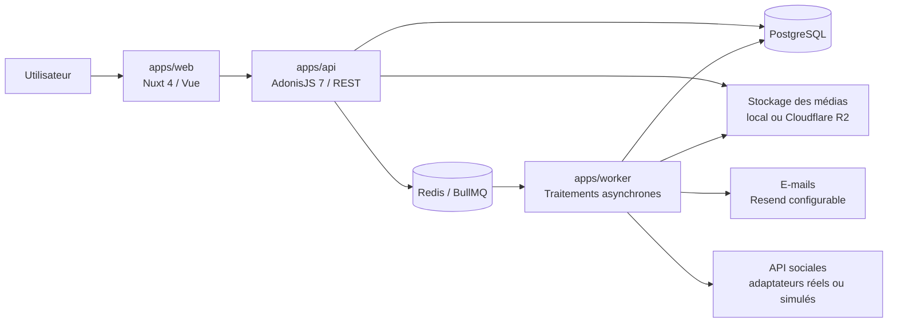

# Architecture du dépôt WePost Pro

## Vue d'ensemble

WePost Pro est organisé sous la forme d'un monorepo `pnpm`. Il regroupe trois
applications exécutables :

- `apps/web` : interface web Nuxt 4 et Vue ;
- `apps/api` : API REST AdonisJS 7 et accès à PostgreSQL ;
- `apps/worker` : traitements asynchrones BullMQ.

PostgreSQL conserve l'état métier durable. Redis est utilisé par les sessions,
les données temporaires et les files BullMQ. Les intégrations avec le stockage
de médias, les fournisseurs d'e-mails et les réseaux sociaux sont isolées
derrière des services ou des adaptateurs configurables.



Les services externes sont simulés par défaut en développement et dans les
tests. Leur présence dans l'architecture ne signifie pas qu'ils sont déjà
configurés sur un environnement de production.

## Arborescence principale

```text
wepost-pro/
├── .github/
│   ├── workflows/
│   │   └── ci.yml                 # Pipeline d'intégration continue
│   ├── ISSUE_TEMPLATE/            # Modèles d'anomalie et de tâche
│   ├── CODEOWNERS
│   ├── dependabot.yml
│   └── pull_request_template.md
├── apps/
│   ├── web/                       # Frontend Nuxt 4 / Vue
│   │   ├── app/
│   │   │   ├── assets/            # Styles et ressources frontend
│   │   │   ├── components/        # Composants d'interface réutilisables
│   │   │   ├── composables/       # Logique Vue réutilisable
│   │   │   ├── i18n/              # Internationalisation
│   │   │   ├── middleware/        # Contrôles de navigation
│   │   │   ├── pages/             # Pages et routes de l'application
│   │   │   ├── plugins/           # Initialisation des services frontend
│   │   │   ├── types/             # Types TypeScript
│   │   │   └── utils/             # Fonctions utilitaires
│   │   ├── server/                # Routes et middleware serveur Nuxt
│   │   ├── tests/                 # Tests unitaires et de composants
│   │   ├── e2e/                   # Parcours Playwright
│   │   ├── public/                # Ressources publiques
│   │   ├── nuxt.config.ts
│   │   ├── playwright.config.ts
│   │   └── vitest.config.ts
│   ├── api/                       # API REST AdonisJS 7
│   │   ├── app/
│   │   │   ├── controllers/       # Adaptation des requêtes HTTP
│   │   │   ├── validators/        # Validation des données entrantes
│   │   │   ├── services/          # Cas d'usage et orchestration applicative
│   │   │   ├── domain/            # Règles et objets du domaine métier
│   │   │   ├── models/            # Modèles Lucid et persistance
│   │   │   ├── middleware/        # Authentification, permissions et sécurité
│   │   │   ├── transformers/      # Transformation des réponses
│   │   │   └── exceptions/        # Gestion centralisée des erreurs
│   │   ├── config/                # Configuration de l'application
│   │   ├── database/
│   │   │   ├── migrations/        # Évolution versionnée du schéma
│   │   │   ├── schema.ts
│   │   │   └── schema_rules.ts
│   │   ├── commands/              # Sauvegarde, restauration et jeux de données
│   │   ├── providers/             # Enregistrement des dépendances
│   │   ├── resources/             # Contrat OpenAPI
│   │   ├── start/                 # Routes, noyau HTTP et démarrage
│   │   └── tests/
│   │       ├── unit/              # Tests des règles isolées
│   │       └── functional/        # Tests HTTP et d'intégration
│   └── worker/                    # Worker BullMQ indépendant
│       ├── src/
│       │   ├── ai/                # Traitements et contrats IA
│       │   ├── social/            # Adaptateurs et processeurs sociaux
│       │   ├── index.ts           # Démarrage et composition des dépendances
│       │   ├── processor.ts       # Traitement des notifications
│       │   ├── repository.ts      # Accès PostgreSQL du worker
│       │   ├── resend_sender.ts   # Adaptateur d'envoi d'e-mails
│       │   └── heartbeat.ts       # Signal de disponibilité du worker
│       └── tests/                 # Tests unitaires du worker
├── docs/
│   ├── architecture/              # Architecture, schéma et décisions
│   ├── api/                       # Documentation des points d'entrée REST
│   ├── design/                    # Concepts visuels
│   ├── deployment/                # Contrôles après déploiement
│   ├── manuals/                   # Manuels d'utilisation et d'exploitation
│   ├── recette/                   # Scénarios et résultats de recette
│   ├── security/                  # Mesures de sécurité par fonctionnalité
│   ├── accessibility/             # Contrôles d'accessibilité par tâche
│   └── evidence/                  # Captures et preuves techniques
├── infra/
│   ├── coolify/                   # Préparation du déploiement Coolify
│   ├── docker/                    # Initialisation des services locaux
│   ├── scripts/                   # Tests de disponibilité
│   └── uptime-kuma/               # Procédure de supervision
├── compose.yaml                   # PostgreSQL et Redis en local
├── package.json                  # Scripts communs du monorepo
├── pnpm-workspace.yaml           # Déclaration des workspaces
├── pnpm-lock.yaml                # Verrouillage des dépendances
├── .env.example                  # Variables documentées sans secret
├── CHANGELOG.md                  # Historique fonctionnel
├── CONTRIBUTING.md               # Règles de contribution
├── SECURITY.md                   # Politique de sécurité
├── README.md                     # Installation et utilisation
└── task01.md ... task23.md       # Périmètre et suivi des incréments
```

## Organisation interne de l'API

L'API combine un découpage par couches techniques et par domaines métier :

1. les routes déclarent les points d'entrée HTTP ;
2. les middleware appliquent l'authentification, les permissions et les
   protections transversales ;
3. les validateurs contrôlent les données reçues ;
4. les contrôleurs coordonnent la requête et la réponse ;
5. les services exécutent les cas d'usage ;
6. le domaine contient les règles métier indépendantes de HTTP ;
7. les modèles Lucid assurent la persistance dans PostgreSQL.

Les domaines couvrent notamment l'authentification, les projets, les
publications, les médias, la collaboration, le calendrier, les réseaux sociaux,
les statistiques, la supervision et les sauvegardes.

## Organisation du worker

Le worker est un processus séparé de l'API. Il reçoit les tâches différées par
BullMQ et dépend de contrats tels que `SocialPublisher`,
`SocialPublicationRepository`, `MediaLoader`, `MediaUrlProvider` ou
`AiTextProvider`. Les implémentations réelles peuvent être remplacées par des
implémentations simulées pendant les tests.

Cette séparation permet :

- de ne pas bloquer les requêtes HTTP pendant un traitement long ;
- de gérer les nouvelles tentatives et l'idempotence ;
- d'isoler les appels aux services externes ;
- de tester les processeurs sans appeler les API réelles.

## Fichiers non constitutifs de l'architecture

Les dépendances, secrets et résultats générés ne font pas partie de
l'architecture source présentée :

- `node_modules/` et `.pnpm-store/` ;
- `.env` et les secrets locaux ;
- `.nuxt/`, `.output/`, `build/` et `dist/` ;
- `coverage/`, `playwright-report/` et `test-results/`.

Ils sont reconstruits à partir des fichiers versionnés et ne doivent pas être
ajoutés au dépôt Git.
