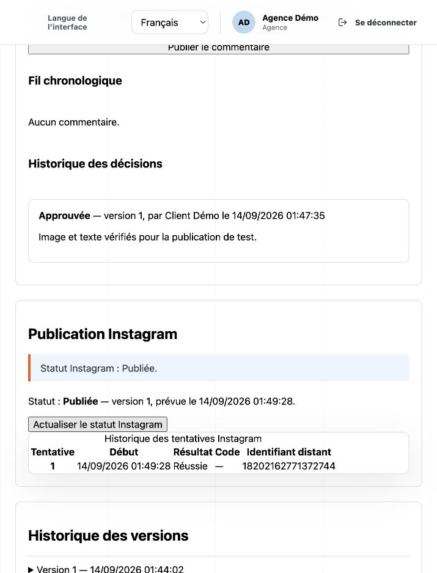
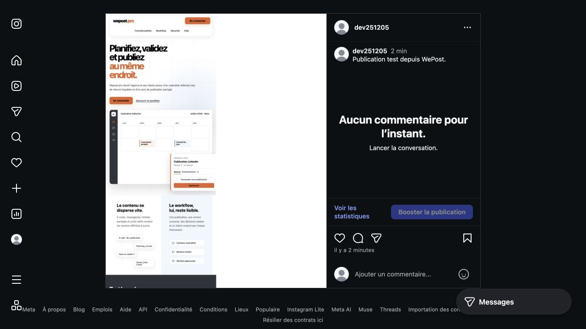

# Vérification réelle — médias privés R2 et Instagram

Périmètre : branche `codex/bc03-demo`, application compilée sur macOS, Node
24.19.0, base locale `wepost_demo`, bucket privé `wepost-demo-media` et compte
Instagram de test autorisé `@dev251205`. Ce test n'est pas un déploiement de
production. Les rôles agence et client ont été opérés pour la recette.

Code vérifié : commit [`ca6993e`](https://github.com/zkyoz/wepost-pro/commit/ca6993e)
(`feat(media): connect private R2 storage to live demo`).

## Stockage et conservation

- Quatre anciens médias, 3 225 931 octets, copiés avec comparaison SHA-256 et
  taille après relecture depuis R2. Aucun fichier supprimé, aucune ligne modifiée.
- Un ancien blob local manquait. Sa source `docs/design/wepost-dashboard-concept.png`
  correspondait exactement à la taille et au SHA-256 conservés en base ; elle a
  été restaurée à l'identique avant la copie.
- CORS : OPTIONS HTTP 204, origine `http://127.0.0.1:3000`, méthodes GET/PUT/HEAD,
  en-tête `content-type` autorisé, max-age 3 600 secondes.
- Nouvel upload réalisé dans l'interface, sans appel direct contournant le
  formulaire : JPEG, alternative textuelle, validation serveur et association.
- Média `9301bd94-f496-4ebb-b884-3489ec96be47`, 715 × 890 pixels,
  SHA-256 `8427425f429a842f850ef120d2f9e55091829886f730cb21f6b7dc8fe1da6a46`.
- Aperçu navigateur chargé depuis le domaine S3 du bucket ; dimensions naturelles
  confirmées. Le compte client voit l'image et son alternative, sans commandes
  de modification des médias. Aucun avertissement ni erreur console relevé dans
  ce parcours de test.
- L'ancien JPEG de la publication Instagram précédente a aussi été rouvert dans
  WePost : aperçu chargé depuis R2, largeur naturelle de 1 080 pixels.

## Liens temporaires

Contrôle HTTP du même objet, sans afficher les clés ni les URLs présignées :

| Contrôle                                                   | Résultat observé                                |
| ---------------------------------------------------------- | ----------------------------------------------- |
| GET signé                                                  | HTTP 200, taille et SHA-256 conformes à la base |
| GET sans signature                                         | HTTP 400, objet non fourni                      |
| GET après expiration d'une signature de test de 2 secondes | HTTP 403                                        |

La durée de 2 secondes est réservée à ce contrôle. L'application utilise 300
secondes pour l'interface et l'adaptateur Instagram demande 1 200 secondes au
fournisseur de liens du worker, à l'exécution du job. Le profil R2 vide les
paramètres du précédent pont HTTPS temporaire.

## Publication réelle

Parcours : création du brouillon → upload JPEG R2 → En cours → soumission →
approbation par Client Démo → validation Instagram par Agence Démo → programmation
immédiate → traitement BullMQ → actualisation du statut.

| Élément               | Valeur                                          |
| --------------------- | ----------------------------------------------- |
| Publication WePost    | `74d2dc8c-3504-43c8-b0d9-ba871a7d563b`          |
| Programmation         | `4acbc813-597f-4282-a186-061cc1ed863c`          |
| Version               | 1                                               |
| État                  | `published`                                     |
| Tentatives            | 1, résultat `success`, aucune erreur normalisée |
| Identifiant Instagram | `18202162771372744`                             |
| Légende               | Publication test depuis WePost.                 |

L'API officielle retourne HTTP 200, le même identifiant, `media_type=IMAGE`,
la légende et le [permalink du post](https://www.instagram.com/p/DdPx3mfjAOB/).
Le post a aussi été ouvert et vérifié visuellement dans Instagram. Il peut être
supprimé ensuite par son propriétaire ; les captures conservent le résultat du test.

## Contrôles de code

- Test CSP initial rouge reproduisant l'absence d'autorisation de connexion R2,
  puis 7 tests CSP verts après correction.
- 114 tests frontend réussis, dont l'origine R2 exacte et le refus d'origines
  non HTTPS ou étrangères.
- 3 tests API de signature R2 réussis sur la base dédiée `wepost_test`.
- 11 tests du lanceur et des helpers de démonstration réussis, dont migration
  sans écrasement, corruption, relecture et exclusion des secrets du processus Nuxt.
- Lint, TypeScript et formatage des trois applications réussis ; builds Nuxt,
  AdonisJS et worker réussis sous Node 24.

Les tests automatiques ne publient pas sur Instagram et n'utilisent pas les
secrets R2. La recette réelle reste distincte de ces tests. La vidéo réelle,
le RGAA manuel complet, la Page LinkedIn et la production ne sont pas validés
par cette vérification des médias.
